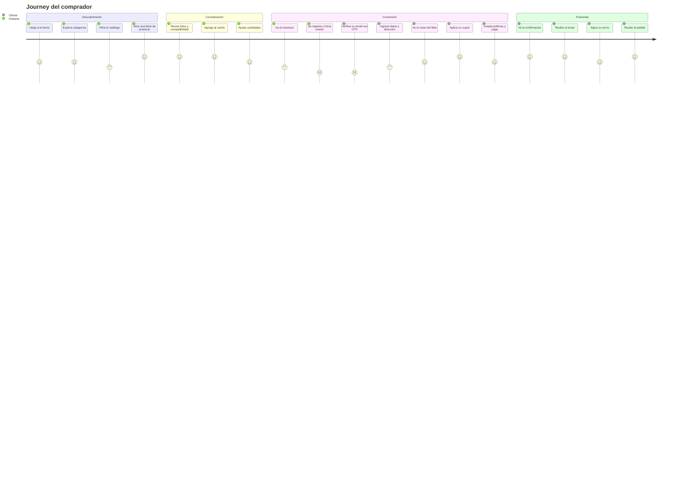
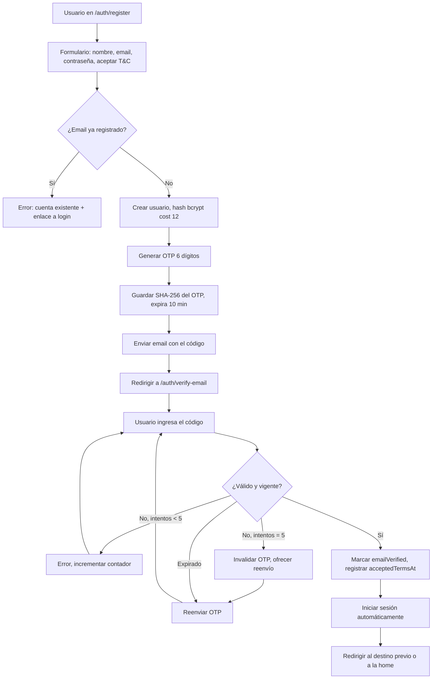
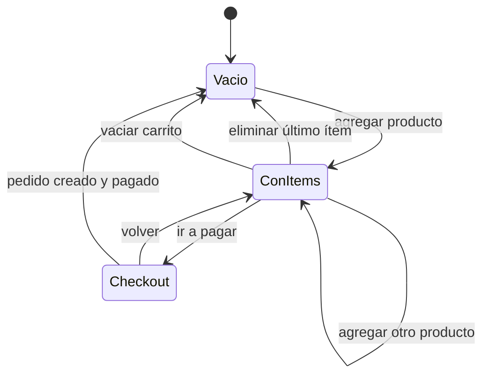
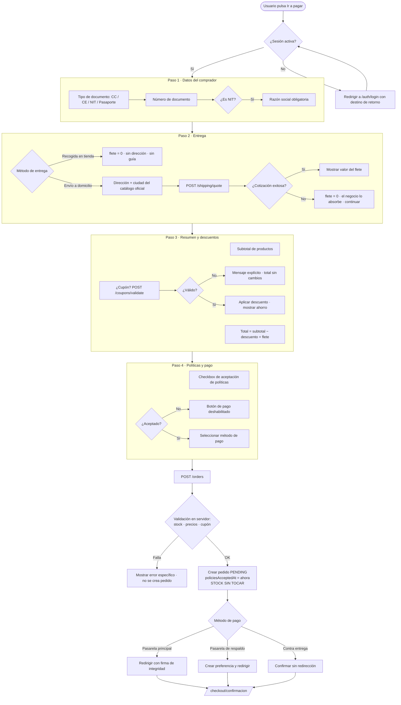
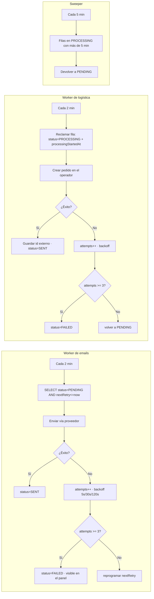
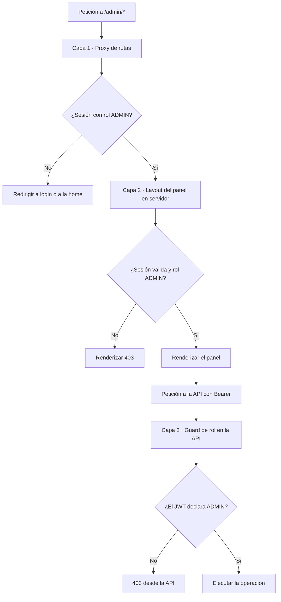
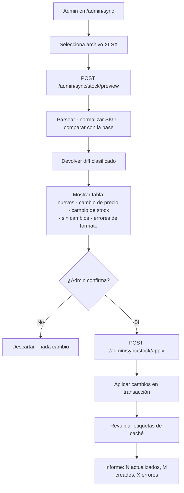
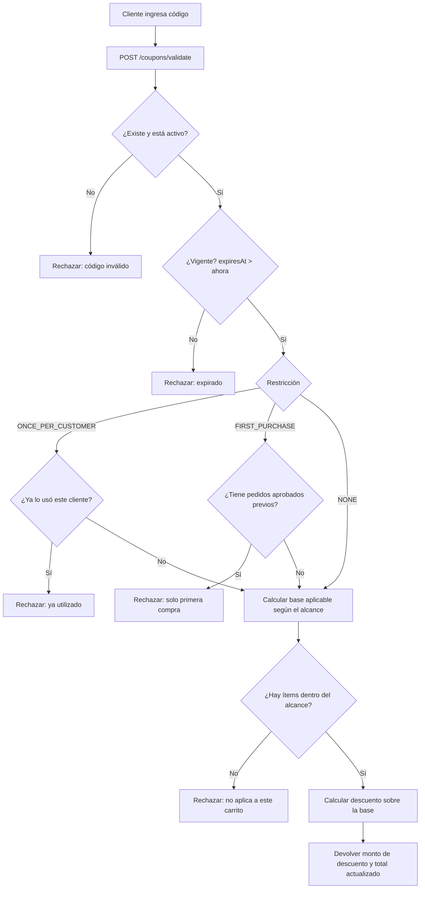
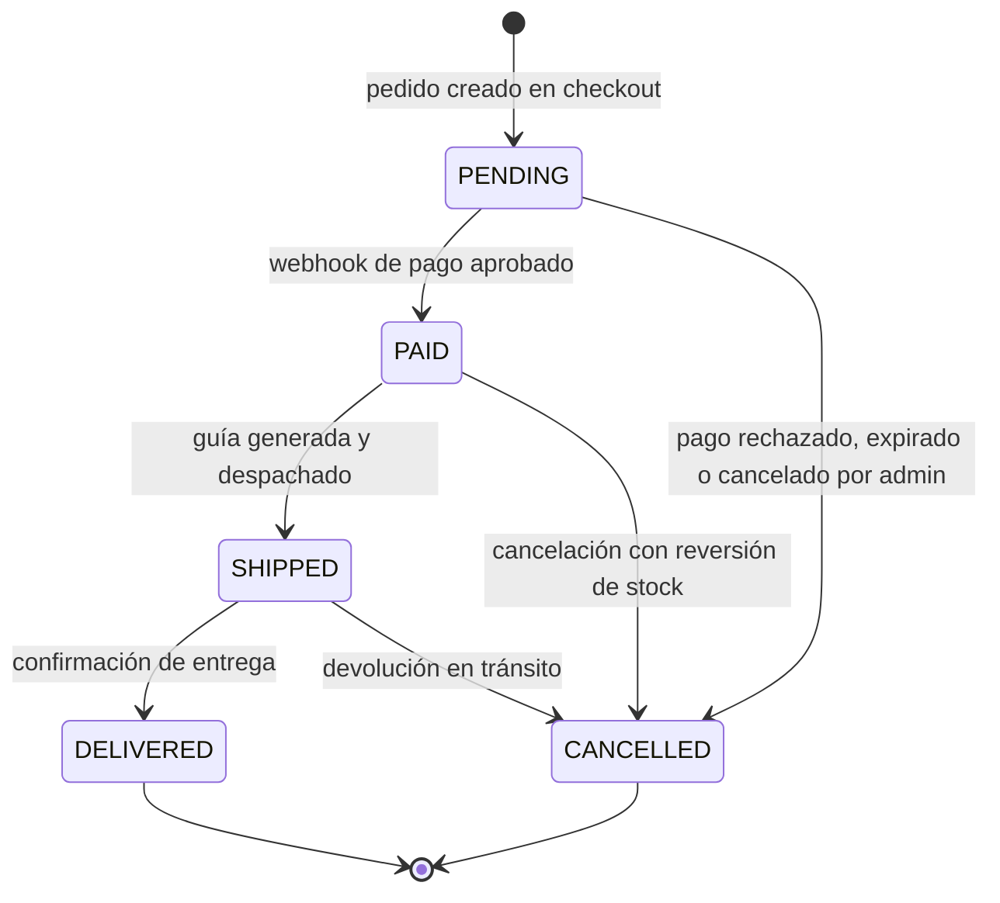

# Flujo de la Aplicación
## User Journey, mapa de navegación y diagramas lógicos

| Campo | Valor |
|---|---|
| Documento | Flujo de App v1.0 |
| Complementa | `01-PRD.md`, `02-TRD.md` |
| Notación | Mermaid + ASCII |

---

## 1. Mapa de navegación

```
/                                   Home (hero, categorías, destacados)
├── /catalogo                       Catálogo con filtros (query params)
│   └── ?categoria= &sub= &min= &max= &orden= &q= &pagina=
├── /producto/[slug]                Ficha de producto
├── /carrito                        Carrito
├── /checkout                       Checkout            🔒 CUSTOMER
│   └── /checkout/confirmacion      Confirmación de pedido 🔒 CUSTOMER
├── /pedidos                        Historial de pedidos 🔒 CUSTOMER
├── /contacto                       Quiénes somos + PQR
├── /legal
│   ├── /terminos-y-condiciones
│   ├── /politica-de-privacidad
│   ├── /politica-de-envios
│   └── /politica-de-cambios
│
├── /auth
│   ├── /login
│   ├── /register
│   ├── /verify-email               Ingreso de código OTP
│   ├── /forgot-password
│   ├── /reset-password/[token]
│   └── /error
│
└── /admin                          🔒 ADMIN
    ├── /                           Dashboard
    ├── /productos                  Listado
    │   ├── /productos/[id]         Edición
    │   └── /productos/papelera     Soft-deleted
    ├── /categorias
    ├── /pedidos
    ├── /stock                      Ajuste puntual
    ├── /sync                       Carga masiva XLSX
    ├── /cupones
    ├── /banners
    └── /configuracion              Interruptores operativos
```

**Leyenda:** 🔒 = ruta protegida por el proxy de rutas + verificación en el servidor.

### 1.1 Estructura persistente

| Zona | Elemento | Presente en |
|---|---|---|
| Header | Logo, buscador, navegación de categorías, contador de carrito, menú de cuenta | Todas las rutas públicas y de cliente |
| Footer | Enlaces legales, contacto, redes | Todas las rutas públicas y de cliente |
| Sidebar admin | Navegación del panel | Todas las rutas `/admin` |

---

## 2. User Journey principal — de visitante a comprador



**Momentos de fricción identificados y su mitigación:**

| Fricción | Mitigación de diseño |
|---|---|
| Registro obligatorio antes de pagar | El carrito se preserva; tras autenticarse el usuario vuelve exactamente al checkout |
| Verificación por OTP | Código de 6 dígitos, reenviable, con contador visible; no se pide contraseña otra vez |
| Costo de envío sorpresa | El flete se calcula y se muestra **antes** de pedir el método de pago |
| Dudas sobre entrega | Opción de recogida en tienda con flete cero, visible desde el primer paso del checkout |

---

## 3. Flujos detallados

### 3.1 Descubrimiento y catálogo

```
┌──────────┐
│   Home   │
└────┬─────┘
     │
     ├── clic en banner ──────────► destino de la CTA
     ├── clic en categoría ───────► /catalogo?categoria=<slug>
     ├── clic en destacado ───────► /producto/<slug>
     └── búsqueda ────────────────► /catalogo?q=<término>
                                          │
                                          ▼
                              ┌───────────────────────┐
                              │      /catalogo        │
                              │  ┌─────────────────┐  │
                              │  │ Panel de filtros│  │
                              │  │ · Categoría     │  │
                              │  │ · Subcategoría  │  │
                              │  │ · Rango precio  │  │
                              │  │ · Solo con stock│  │
                              │  │ · Orden         │  │
                              │  └────────┬────────┘  │
                              │           │ actualiza │
                              │           │ la URL    │
                              │  ┌────────▼────────┐  │
                              │  │  Grilla + paginación│
                              │  └────────┬────────┘  │
                              └───────────┼───────────┘
                                          ▼
                              ┌───────────────────────┐
                              │  /producto/[slug]     │
                              │  · Galería            │
                              │  · Precio y stock     │
                              │  · Descripción general│
                              │  · Beneficios         │
                              │  · Compatibilidad     │
                              │  · Selector cantidad  │
                              │  · [Agregar al carrito]│
                              │  · Relacionados       │
                              └───────────────────────┘
```

**Reglas de estado del filtro:** el estado de los filtros vive en la URL, no en memoria del cliente. Consecuencias: la vista filtrada es compartible, el botón "atrás" del navegador funciona, y el servidor puede renderizar el resultado directamente.

**Estados de la grilla:**

| Estado | Presentación |
|---|---|
| Cargando | Esqueletos con la forma exacta de la tarjeta |
| Con resultados | Grilla responsive + total de resultados |
| Vacío por filtros | Mensaje + acción "Limpiar filtros" |
| Vacío por búsqueda | Mensaje + sugerencias de categorías |
| Error | Mensaje + acción "Reintentar" |

### 3.2 Autenticación



**Flujo de credenciales (login):**

```
Navegador                Frontend                    API
   │                        │                          │
   │─ email + contraseña ──►│                          │
   │                        │─ POST /auth/login ──────►│
   │                        │                          │─ buscar usuario
   │                        │                          │─ bcrypt.compare
   │                        │                          │─ ¿emailVerified?
   │                        │◄── { user, accessToken }─│
   │                        │                          │
   │                        │─ crear sesión JWT        │
   │                        │  { id, role, accessToken}│
   │◄─ cookie de sesión ────│                          │
```

**Flujo OAuth:**

```
Navegador ─► Proveedor OAuth ─► callback del frontend
                                      │
                                      ▼
                        adaptador crea/actualiza el usuario
                                      │
                                      ▼
                     POST /auth/session-token  (header: secreto interno)
                                      │
                                      ▼
                        API devuelve su propio JWT
                                      │
                                      ▼
                     sesión = { id, role, accessToken }
```

**Recuperación de contraseña:**

```
/auth/forgot-password ──► POST /auth/forgot-password
                              │
                              ├─ genera token aleatorio
                              ├─ guarda SHA-256 + expiración
                              ├─ envía email con el token crudo
                              └─ responde SIEMPRE 200  ← no revela si el email existe
                                       │
                              /auth/reset-password/[token]
                                       │
                              POST /auth/reset-password
                                       ├─ hashea el token recibido y lo busca
                                       ├─ verifica vigencia y que no esté usado
                                       ├─ actualiza contraseña
                                       └─ marca el token como usado
```

### 3.3 Carrito



**Reglas:**
- El carrito se persiste en almacenamiento local bajo una clave **particionada por usuario**. Al iniciar sesión se carga el carrito de esa identidad; al cerrar sesión no se filtra al siguiente usuario del dispositivo.
- La cantidad de cada línea está acotada por el stock disponible del producto.
- El carrito guarda una copia del precio y el nombre para renderizar sin consultar, pero el **precio autoritativo se recalcula en el servidor** al crear el pedido.
- Retroalimentación inmediata al agregar: animación de confirmación + actualización del contador del header + notificación efímera.

### 3.4 Checkout — el flujo crítico



**Punto de diseño clave:** la creación del pedido y el cobro son pasos separados. Un pedido `PENDING` sin pago no consume inventario ni genera obligaciones logísticas; simplemente expira en la práctica.

### 3.5 Confirmación de pago (asíncrona)

```
   Usuario                Pasarela                 API                    Base de datos
      │                      │                      │                          │
      │─ paga en la pasarela►│                      │                          │
      │                      │                      │                          │
      │◄─ redirige a         │                      │                          │
      │   /checkout/confirmacion                    │                          │
      │                      │                      │                          │
      │  «Estamos           │─ POST /payments/*/webhook ──►                     │
      │   confirmando        │                      │                          │
      │   tu pago…»          │                      │─ verificar firma         │
      │                      │                      │  (rechaza si inválida)   │
      │                      │                      │                          │
      │                      │                      │─ leer pedido ───────────►│
      │                      │                      │◄─ status actual ─────────│
      │                      │                      │                          │
      │                      │                      │  ¿ya está PAID?          │
      │                      │                      │  ─► sí: responder 200    │
      │                      │                      │      sin efectos         │
      │                      │                      │                          │
      │                      │                      │─ [TRANSACCIÓN] ─────────►│
      │                      │                      │   order.status = PAID    │
      │                      │                      │   payment.status=APPROVED│
      │                      │                      │   decrementStock atómico │
      │                      │                      │   emailQueue.insert      │
      │                      │                      │   shippingQueue.insert   │
      │                      │                      │◄─────────────────────────│
      │                      │◄─ 200 OK ────────────│                          │
      │                      │                      │                          │
      │─ la página consulta el estado ─────────────►│                          │
      │◄─ pedido confirmado ────────────────────────│                          │
```

**La página de confirmación no decide nada.** Consulta el estado del pedido y muestra:
- `PENDING` → "Estamos confirmando tu pago" con reintento automático.
- `PAID` → confirmación completa con número de pedido y detalle.
- Pago rechazado → mensaje y opción de reintentar con otro método.

### 3.6 Procesamiento asíncrono (workers)



**Por qué el sweeper existe:** en una plataforma de contenedores efímeros, una instancia puede morir después de marcar la fila como `PROCESSING` y antes de completar el trabajo. Sin el sweeper, ese pedido nunca se despacharía y nadie se enteraría.

### 3.7 Seguimiento del envío

```
Operador logístico ──► POST /vendelo/webhook  (firma verificada)
                              │
                              ▼
                    mapear evento → estado de envío
                              │
              PENDING → READY → PREPARING → SHIPPED → DELIVERED
                    │                          │
                    └──► CANCELLED             └──► INCIDENT ──► RETURNED
                              │
                              ▼
                  upsert del Shipment del pedido
                  (número de guía, transportador, URL de etiqueta)
                              │
                              ▼
                 visible en /pedidos para el cliente
```

**Excepciones de envío:** cuando el operador rechaza una dirección o marca un destinatario como no confiable, se registra una excepción. El administrador la resuelve desde el panel (corrigiendo datos o autorizando el envío) y el pedido se reencola.

### 3.8 Historial de pedidos (cliente)

```
/pedidos
   │
   ├─ lista de pedidos del usuario autenticado (solo los suyos)
   │     · número, fecha, total, estado del pedido, estado del envío
   │
   └─ detalle de un pedido
         · ítems con precio congelado al momento de la compra
         · dirección o punto de recogida
         · desglose: subtotal · descuento · flete · total
         · número de guía y seguimiento (si aplica)
         · descarga del comprobante en PDF
```

---

## 4. Flujos administrativos

### 4.1 Acceso al panel — triple verificación



Cada capa asume que las anteriores pudieron ser evadidas. Un atacante que llame directamente a la API con un token de cliente choca contra la capa 3.

### 4.2 Gestión de productos

```
/admin/productos
   ├─ listado con búsqueda, filtro por categoría y estado
   ├─ [Nuevo producto] ──► formulario
   │     · datos básicos: nombre, slug, SKU, precio, stock
   │     · categoría
   │     · imágenes → subida al CDN → se guardan las URLs
   │     · dimensiones y peso (necesarios para cotizar flete)
   │     · descripción estructurada: general + beneficios + compatibilidad
   │     └─► POST /admin/products ──► revalidar etiquetas de caché
   │
   ├─ [Editar] ──► PUT /admin/products/:id ──► revalidar
   ├─ [Eliminar] ──► DELETE /admin/products/:id  (soft delete)
   │                  ──► desaparece del catálogo · va a la papelera
   └─ /papelera
         └─ [Restaurar] ──► PATCH /admin/products/:id/restore ──► revalidar
```

### 4.3 Sincronización masiva de stock



**Principio:** ninguna operación destructiva o masiva se ejecuta sin una previsualización explícita del efecto.

### 4.4 Gestión de pedidos

```
/admin/pedidos
   ├─ filtros: estado, rango de fechas, búsqueda por cliente o número
   ├─ tabla: número · cliente · fecha · total · estado · envío
   └─ detalle
        ├─ [Cambiar estado] ──► PATCH /orders/:id/status
        ├─ [Generar guía]   ──► POST /admin/vendelo/create-shipments
        ├─ [Descargar etiqueta] ──► POST /admin/vendelo/generate-labels
        ├─ [Solicitar recogida] ──► POST /admin/vendelo/request-pickup
        └─ [Resolver excepción] ──► POST /admin/vendelo/exceptions/:id/resolve
```

### 4.5 Cupones

```
/admin/cupones
   └─ [Nuevo cupón]
        · código (único, se normaliza a mayúsculas)
        · tipo: PORCENTAJE (puntos base) o FIJO (centavos)
        · valor
        · alcance excluyente: categoría (incluye subcategorías) O producto
        · restricción: ninguna · una vez por cliente · solo primera compra
        · fecha de expiración
        └─► POST /coupons
```

**Validación en el checkout:**



**Regla de seguridad:** este mismo cálculo se repite íntegramente al crear el pedido. El resultado enviado por el cliente jamás se acepta como autoritativo.

### 4.6 Configuración operativa

```
/admin/configuracion
   ├─ [Pasarela de respaldo]  activada / desactivada
   ├─ [Pago contra entrega]   activado / desactivado
   └─ [Cobro de flete en línea] activado / desactivado
         └─ desactivado ⇒ el negocio absorbe el flete en todos los pedidos
```

Estos interruptores viven en la base de datos, no en variables de entorno, para permitir cambios operativos sin redeploy.

---

## 5. Máquinas de estado

### 5.1 Estado del pedido



| Transición | Disparador | Efectos |
|---|---|---|
| → `PENDING` | Creación en checkout | Ninguno sobre inventario |
| `PENDING` → `PAID` | Webhook firmado con estado aprobado | Descuento atómico de stock, encolado de email y de guía |
| `PENDING` → `CANCELLED` | Webhook rechazado / acción de admin | Ninguno sobre inventario |
| `PAID` → `SHIPPED` | Guía generada / webhook del operador | Registro de guía y transportador |
| `SHIPPED` → `DELIVERED` | Webhook del operador | Cierre del ciclo |
| `PAID`/`SHIPPED` → `CANCELLED` | Acción de admin | Reversión de stock (operación explícita y auditada) |

### 5.2 Estado del pago

```
PENDING ──► APPROVED   (webhook: transacción aprobada)
   │
   ├──────► DECLINED   (webhook: rechazada por el emisor)
   ├──────► VOIDED     (anulada antes de la captura)
   └──────► ERROR      (fallo técnico de la pasarela)
```

### 5.3 Estado del envío

```
PENDING ──► READY ──► PREPARING ──► SHIPPED ──► DELIVERED
   │                                    │
   │                                    ├──► INCIDENT ──► RETURNED
   │                                    │
   └──► CANCELLED ◄─────────────────────┘
```

### 5.4 Estado de las colas

```
PENDING ──(worker reclama)──► PROCESSING ──(éxito)──► SENT
   ▲                              │
   │                          (fallo, attempts<3)
   │                              │
   └──────────────────────────────┘
                                  │
                          (attempts>=3)
                                  ▼
                               FAILED

PROCESSING ──(más de 5 min sin avance, sweeper)──► PENDING
```

---

## 6. Manejo de errores en la interfaz

| Escenario | Comportamiento esperado |
|---|---|
| Producto agotado al agregar al carrito | Notificación explicando el stock disponible; la cantidad se ajusta al máximo posible |
| Stock insuficiente al crear el pedido | Error identificando el producto concreto; el usuario vuelve al carrito con el ítem marcado |
| Cotización de flete falla | El checkout continúa con flete cero y una nota; no se bloquea la compra |
| Pasarela de pago no responde | Mensaje con opción de reintentar o cambiar de método; el pedido queda en `PENDING` |
| Cupón inválido | Mensaje específico según la causa (inexistente, expirado, ya usado, fuera de alcance) |
| Sesión expirada durante el checkout | Redirección a login preservando el carrito y el destino de retorno |
| Falla del CDN de imágenes | Placeholder; el resto de la ficha funciona |
| Error 500 de la API | Página de error con acción de reintento y captura en la herramienta de observabilidad |

**Principio:** ningún error técnico se muestra crudo al usuario. Cada código de error del dominio tiene un mensaje en español, orientado a la acción que el usuario puede tomar.

---

## 7. Rutas y protección — matriz consolidada

| Ruta | Público | Cliente | Admin | Protección |
|---|:---:|:---:|:---:|---|
| `/`, `/catalogo`, `/producto/[slug]` | ✅ | ✅ | ✅ | — |
| `/carrito` | ✅ | ✅ | ✅ | — |
| `/contacto`, `/legal/*` | ✅ | ✅ | ✅ | — |
| `/auth/*` | ✅ | redirige | redirige | Redirección si ya hay sesión |
| `/checkout`, `/checkout/confirmacion` | ❌ | ✅ | ✅ | Proxy + verificación en servidor |
| `/pedidos` | ❌ | ✅ | ✅ | Proxy + filtro por identidad del usuario |
| `/admin/*` | ❌ | ❌ | ✅ | Proxy + layout en servidor + guard de rol en API |
