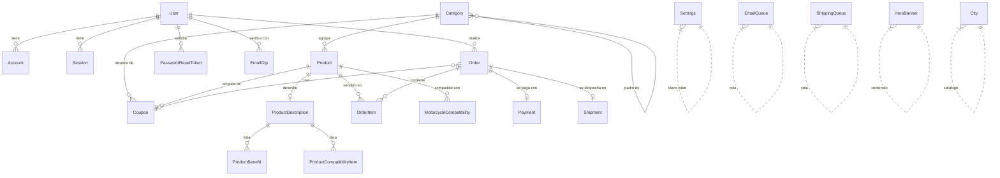

# Esquema Backend
## Modelo de datos, diseño de API y lógica de negocio

| Campo | Valor |
|---|---|
| Documento | Esquema Backend v1.0 |
| Complementa | `02-TRD.md`, `03-FLUJO-APP.md` |
| Base de datos | PostgreSQL 16 · ORM Prisma 7 |
| API | REST sobre NestJS |

---

## 1. Modelo de datos

### 1.1 Diagrama entidad-relación



### 1.2 Enumeraciones

| Enum | Valores | Notas |
|---|---|---|
| `Role` | `ADMIN`, `CUSTOMER` | Por defecto `CUSTOMER` |
| `OrderStatus` | `PENDING`, `PAID`, `SHIPPED`, `DELIVERED`, `CANCELLED` | Máquina de estados del §5.1 del doc de flujo |
| `PaymentProvider` | `PRIMARY_GATEWAY`, `BACKUP_GATEWAY`, `COD` | `COD` = pago contra entrega |
| `PaymentStatus` | `PENDING`, `APPROVED`, `DECLINED`, `VOIDED`, `ERROR` | Refleja el estado en la pasarela |
| `DeliveryMethod` | `HOME_DELIVERY`, `STORE_PICKUP` | `STORE_PICKUP` fuerza flete 0 y omite la cola logística |
| `CouponType` | `PERCENTAGE`, `FIXED` | `PERCENTAGE` en **puntos base** (1000 = 10.00 %); `FIXED` en centavos |
| `CouponRestriction` | `NONE`, `ONCE_PER_CUSTOMER`, `FIRST_PURCHASE` | Evaluadas en la validación del cupón |

**Sobre `PERCENTAGE` en puntos base:** almacenar `10.5 %` como `1050` mantiene la promesa de "cero flotantes" en todo el sistema monetario y permite descuentos con dos decimales de precisión sin errores de redondeo.

### 1.3 Entidades

#### `User` — identidad
| Campo | Tipo | Restricciones | Notas |
|---|---|---|---|
| `id` | `String` | PK, cuid | |
| `email` | `String` | **único**, no nulo | Identificador de login |
| `name` | `String?` | | |
| `image` | `String?` | | Avatar de OAuth |
| `password` | `String?` | | Hash bcrypt cost 12. **Nulo** en usuarios exclusivamente OAuth |
| `role` | `Role` | por defecto `CUSTOMER` | |
| `emailVerified` | `DateTime?` | | Nulo hasta validar el OTP |
| `acceptedTermsAt` | `DateTime?` | | Evidencia legal |
| `acceptedTermsVersion` | `String?` | | Permite detectar re-aceptación tras una actualización de los términos |
| `marketingConsent` | `Boolean` | por defecto `false` | **Independiente** del consentimiento de T&C (Ley 1581/2012) |
| `marketingConsentAt` | `DateTime?` | | |
| `createdAt` | `DateTime` | por defecto `now()` | |

#### `Account`, `Session`, `VerificationToken`
Modelos requeridos por el adaptador de autenticación. `Account` tiene índice único compuesto `(provider, providerAccountId)`. Ambos con borrado en cascada desde `User`.

#### `EmailOtp` — verificación de email
| Campo | Tipo | Notas |
|---|---|---|
| `id` | `String` | PK |
| `userId` | `String` | FK → `User`, cascada |
| `codeHash` | `String` | **SHA-256** del código de 6 dígitos. Jamás el código en claro |
| `expiresAt` | `DateTime` | Emisión + 10 minutos |
| `usedAt` | `DateTime?` | Consumo de un solo uso |
| `attempts` | `Int` | Por defecto 0; a los 5 el código se invalida |
| `createdAt` | `DateTime` | |

Índice: `(userId)`.

#### `PasswordResetToken`
| Campo | Tipo | Notas |
|---|---|---|
| `tokenHash` | `String` | **único**, SHA-256 del token crudo enviado por email |
| `expiresAt` | `DateTime` | Vigencia corta (1 h) |
| `usedAt` | `DateTime?` | Un solo uso |

Índice: `(userId)`.

#### `Category` — taxonomía jerárquica
| Campo | Tipo | Notas |
|---|---|---|
| `id` | `String` | PK |
| `name` | `String` | |
| `slug` | `String` | **único**, usado en la URL |
| `description` | `String?` | |
| `imageUrl` | `String?` | |
| `parentId` | `String?` | **Nulo ⇒ categoría raíz**; no nulo ⇒ subcategoría |

Auto-relación `CategoryTree` (`parent` ↔ `children`). La jerarquía es de **dos niveles** por diseño de producto; el esquema permite más, la interfaz no.

#### `Product` — catálogo
| Campo | Tipo | Restricciones | Notas |
|---|---|---|---|
| `id` | `String` | PK | |
| `name` | `String` | | |
| `slug` | `String` | **único** | URL pública |
| `description` | `String` | texto largo | Descripción plana; la enriquecida vive en `ProductDescription` |
| `price` | `Int` | ≥ 0 | **Centavos COP** |
| `stock` | `Int` | ≥ 0, por defecto 0 | Solo se modifica atómicamente |
| `sku` | `String` | **único** | Clave de conciliación con el inventario físico |
| `images` | `String[]` | | URLs del CDN, ordenadas (la primera es la principal) |
| `isActive` | `Boolean` | por defecto `true` | Visibilidad pública |
| `weightKg` | `Float?` | | Necesario para cotizar flete; si es nulo se usa un peso por defecto |
| `heightCm` `widthCm` `lengthCm` | `Int?` | | Volumétrico para el operador logístico |
| `categoryId` | `String` | FK → `Category` | |
| `deletedAt` | `DateTime?` | | **Soft delete**. Nulo = activo |
| `createdAt` / `updatedAt` | `DateTime` | | |

**Índices (justificados por consultas reales):**
- `(categoryId, isActive, stock)` — filtro dominante del catálogo público.
- `(isActive, createdAt)` — listados por novedad.
- `(deletedAt)` — exclusión en toda consulta normal y vista de papelera.

**Regla:** nunca `delete()`. Siempre `softDelete(id)`. Un producto borrado físicamente rompería el historial de pedidos.

#### `ProductDescription` + `ProductBenefit` + `ProductCompatibilityItem`
Descripción enriquecida y editable desde el panel, en relación 1:1 con el producto (cascada al borrar).

- `ProductDescription`: `generalDescription` (texto largo).
- `ProductBenefit`: `title?`, `body`, `order`. Índice `(descriptionId, order)`.
- `ProductCompatibilityItem`: `body` como texto libre legible ("Honda CB160F 2020-2023"), `order`. Índice `(descriptionId, order)`.

**Decisión de diseño:** la compatibilidad se modela como texto libre editable por el administrador, no como una tabla normalizada de marca/modelo/año. La tabla normalizada (`MotorcycleCompatibility`) existe en el esquema para un futuro filtro estructurado "busca por tu moto", pero **no** es la fuente que se muestra al comprador. Evitar mantener dos fuentes de verdad en producción: una debe alimentar a la otra.

#### `MotorcycleCompatibility` — compatibilidad estructurada (reservada)
`productId`, `brand`, `model`, `year?`. Índice `(productId)`. Base para un buscador por moto en versiones futuras.

#### `Order` — pedido
| Campo | Tipo | Notas |
|---|---|---|
| `id` | `String` | PK; se muestra al cliente como número de pedido |
| `userId` | `String` | FK → `User` |
| `status` | `OrderStatus` | Por defecto `PENDING` |
| `total` | `Int` | **Centavos.** Subtotal − descuento + flete cobrado en línea |
| `shippingTotal` | `Int` | Componente de flete incluido en `total`. 0 = absorbido por el negocio |
| `shippingAddress` | `Json` | Instantánea de la dirección al momento de la compra |
| `deliveryMethod` | `DeliveryMethod` | `STORE_PICKUP` ⇒ `shippingTotal = 0` y sin encolado logístico |
| `paymentProvider` | `PaymentProvider` | |
| `externalShippingId` | `String?` | Identificador del pedido en el operador logístico |
| `policiesAcceptedAt` | `DateTime?` | **Evidencia inmutable** del instante de aceptación |
| `buyerIdType` | `String` | `CC` \| `CE` \| `NIT` \| `PASAPORTE`; por defecto `CC` |
| `buyerIdNumber` | `String` | Texto: el NIT incluye dígito de verificación y la CE puede tener letras |
| `buyerBusinessName` | `String?` | Solo cuando `buyerIdType = NIT` |
| `couponCode` | `String?` | FK → `Coupon.code`. Se conserva como rastro de auditoría aunque el cupón se desactive |
| `discountAmount` | `Int` | Centavos descontados; 0 si no hubo cupón |
| `createdAt` | `DateTime` | |

Índice: `(status, createdAt)` — cubre el filtro del panel y las agregaciones de ingresos del dashboard.

**Por qué `shippingAddress` es JSON:** la dirección se congela como instantánea. Si el usuario edita su perfil después, el pedido histórico conserva la dirección real de entrega. Una relación normalizada permitiría mutar el pasado.

#### `OrderItem` — línea de pedido
| Campo | Tipo | Notas |
|---|---|---|
| `orderId` | `String` | FK → `Order`, cascada |
| `productId` | `String` | FK → `Product` (**sin** cascada: el producto no se borra físicamente) |
| `quantity` | `Int` | |
| `priceAtPurchase` | `Int` | **Centavos. Precio congelado al momento de la compra** |

`priceAtPurchase` es innegociable: si el administrador sube el precio mañana, el pedido de ayer debe seguir reflejando lo que el cliente pagó.

#### `Payment` — transacción
| Campo | Tipo | Notas |
|---|---|---|
| `orderId` | `String` | **único** (relación 1:1) |
| `provider` | `PaymentProvider` | |
| `externalId` | `String?` | Identificador de la transacción en la pasarela |
| `status` | `PaymentStatus` | Por defecto `PENDING` |
| `amount` | `Int` | Centavos |

#### `Shipment` — envío
| Campo | Tipo | Notas |
|---|---|---|
| `orderId` | `String` | **único** (1:1), cascada |
| `status` | `String` | `PENDING` \| `READY` \| `PREPARING` \| `SHIPPED` \| `INCIDENT` \| `DELIVERED` \| `RETURNED` \| `CANCELLED` |
| `trackingNumber` | `String?` | |
| `carrier` | `String?` | |
| `labelUrl` | `String?` | PDF de la guía |

Se crea al recibir el primer webhook del operador logístico.

#### `Coupon` — promociones
| Campo | Tipo | Notas |
|---|---|---|
| `code` | `String` | **único**, normalizado a mayúsculas |
| `type` | `CouponType` | |
| `value` | `Int` | Puntos base o centavos según el tipo |
| `restriction` | `CouponRestriction` | |
| `isActive` | `Boolean` | Soft delete: nunca se borra una fila |
| `expiresAt` | `DateTime` | Evaluada de forma perezosa en la validación; **sin** tarea programada |
| `categoryId` | `String?` | Alcance por categoría (**incluye subcategorías**) |
| `productId` | `String?` | Alcance por producto específico |

**Invariante:** exactamente uno de `categoryId` o `productId` es no nulo. Se valida en el DTO de la API, no en el esquema.

Índices: `(code)`, `(isActive, expiresAt)`.

#### `Settings` — configuración operativa
Tabla clave-valor (`key` único, `value` texto). Claves esperadas:

| Clave | Efecto |
|---|---|
| `BACKUP_GATEWAY_ENABLED` | Muestra u oculta la pasarela de respaldo en el checkout |
| `COD_ENABLED` | Habilita el pago contra entrega |
| `SHIPPING_ONLINE_ENABLED` | Si es falso, el negocio absorbe el flete en todos los pedidos |

Vive en base de datos, no en variables de entorno, para permitir cambios operativos sin redeploy.

#### `EmailQueue` y `ShippingQueue` — colas persistidas
| Campo | Tipo | Notas |
|---|---|---|
| `status` | `String` | `PENDING` \| `PROCESSING` \| `SENT` \| `FAILED` |
| `attempts` | `Int` | Máximo 3 |
| `lastError` | `String?` | Diagnóstico visible en el panel |
| `nextRetry` | `DateTime` | Backoff: 5 s → 30 s → 120 s |
| `processingStartedAt` | `DateTime?` | Solo en la cola logística: marca de reclamo por un worker |

Índice en ambas: `(status, nextRetry)` — la consulta exacta del worker.

`processingStartedAt` habilita el **sweeper**: si una fila lleva más de 5 minutos en `PROCESSING`, se devuelve a `PENDING`. Cubre la muerte de un contenedor a mitad de proceso.

#### `HeroBanner` — contenido de la home
| Campo | Tipo | Notas |
|---|---|---|
| `imageUrl` | `String` | URL optimizada del CDN |
| `imagePublicId` | `String` | Identificador del recurso en el CDN — **necesario para borrar la imagen** al eliminar o reemplazar el banner y evitar huérfanos |
| `title`, `description?`, `ctaLabel?`, `ctaUrl?` | | Texto en HTML, nunca incrustado en la imagen |
| `order` | `Int` | Orden en el carrusel |
| `isActive` | `Boolean` | |

Índice: `(isActive, order)`.

#### `City` — catálogo de destinos
| Campo | Tipo | Notas |
|---|---|---|
| `code` | `String` | **PK**. Código oficial DIVIPOLA de 8 dígitos (ej. `05001000` = Medellín) |
| `name` | `String` | |
| `subdivisionCode` | `String` | Subdivisión dentro de la ciudad |
| `countryCode` | `String` | Por defecto `CO` |

Índice: `(name)`. Se puebla por sincronización con el operador logístico y se cachea 24 h en el checkout.

### 1.4 Convenciones transversales del esquema

| Convención | Regla |
|---|---|
| Identificadores | `cuid()` — ordenables por tiempo, seguros para exponer en URL |
| Dinero | Siempre `Int` en centavos COP. **Nunca** `Float` ni `Decimal` |
| Porcentajes | Puntos base (`Int`) |
| Fechas | `DateTime` en UTC; la conversión a hora local ocurre en la presentación |
| Borrado | Soft delete en entidades referenciadas históricamente (productos, cupones) |
| Cascadas | Solo hacia entidades subordinadas sin valor histórico propio (descripciones, tokens, líneas de pedido) |
| Instantáneas | Precio y dirección se congelan en el pedido |

---

## 2. Diseño de la API

### 2.1 Convenciones

| Aspecto | Definición |
|---|---|
| Base | `https://api.<dominio>` — sin prefijo de versión en v1; se introducirá `/v2` si hay ruptura |
| Formato | JSON en petición y respuesta |
| Autenticación | `Authorization: Bearer <jwt>` |
| Autenticación servidor-a-servidor | Header `x-internal-secret` |
| Estado por defecto | **Protegido.** Las rutas públicas se marcan con un decorador explícito |
| Validación | Pipe global con lista blanca; campo desconocido ⇒ 400 |
| Errores | Cuerpo uniforme (§2.4) |
| Rate limit | 100 req/min por IP; más estricto en autenticación y validación de cupones |
| Documentación | Esquema OpenAPI en `/api/docs`, **solo en entornos no productivos** |

### 2.2 Catálogo completo de endpoints

#### Salud
| Método | Ruta | Acceso | Descripción |
|---|---|---|---|
| `GET` | `/health` | Público | Sonda de liveness/readiness del orquestador |

#### Autenticación — `/auth`
| Método | Ruta | Acceso | Cuerpo | Respuesta |
|---|---|---|---|---|
| `POST` | `/auth/register` | Público | `{ email, password, name, acceptedTerms, marketingConsent? }` | `{ userId }` + envío de OTP |
| `POST` | `/auth/login` | Público | `{ email, password }` | `{ user, accessToken }` |
| `POST` | `/auth/verify-email` | Público | `{ email, code }` | `{ user, accessToken }` |
| `POST` | `/auth/resend-otp` | Público (limitado) | `{ email }` | `204` |
| `POST` | `/auth/session-token` | Interno (`x-internal-secret`) | `{ email }` | `{ accessToken }` |
| `POST` | `/auth/forgot-password` | Público (limitado) | `{ email }` | `204` — **siempre**, exista o no el email |
| `POST` | `/auth/reset-password` | Público | `{ token, newPassword }` | `204` |

#### Productos (público) — `/products`
| Método | Ruta | Acceso | Parámetros |
|---|---|---|---|
| `GET` | `/products` | Público | `q`, `categoryId`, `minPrice`, `maxPrice`, `inStock`, `sort`, `page`, `limit` |

> El storefront lee el catálogo directamente desde la base de datos en el servidor de render. Este endpoint existe para clientes externos, integraciones y consumo desde el cliente.

#### Cupones — `/coupons`
| Método | Ruta | Acceso | Cuerpo / Descripción |
|---|---|---|---|
| `POST` | `/coupons/validate` | Autenticado (limitado) | `{ code, items: [{ productId, quantity, unitPrice }] }` → `{ valid, discountAmount, reason? }` |
| `GET` | `/coupons` | ADMIN | Listado con filtros |
| `POST` | `/coupons` | ADMIN | Crear |
| `PATCH` | `/coupons/:id` | ADMIN | Actualizar |
| `DELETE` | `/coupons/:id` | ADMIN | Desactivar (soft) |

#### Envíos — `/shipping`
| Método | Ruta | Acceso | Cuerpo |
|---|---|---|---|
| `POST` | `/shipping/quote` | Público | `{ cityCode, items: [{ productId, quantity }] }` → `{ shippingTotal, estimatedDays }` |

#### Pedidos — `/orders`
| Método | Ruta | Acceso | Descripción |
|---|---|---|---|
| `POST` | `/orders` | Autenticado | Crea el pedido en `PENDING`. **No toca el stock** |
| `PATCH` | `/orders/:id/status` | ADMIN | Transición de estado |

Cuerpo de `POST /orders`:
```jsonc
{
  "items": [{ "productId": "…", "quantity": 2 }],
  "deliveryMethod": "HOME_DELIVERY",
  "shippingAddress": { "line1": "…", "cityCode": "05001000", "notes": "…" },
  "buyerIdType": "CC",
  "buyerIdNumber": "1020304050",
  "buyerBusinessName": null,
  "couponCode": "BIENVENIDO10",
  "paymentProvider": "PRIMARY_GATEWAY",
  "policiesAccepted": true
}
```
Respuesta:
```jsonc
{
  "orderId": "clx…",
  "total": 13498500,
  "shippingTotal": 1200000,
  "discountAmount": 1366500,
  "paymentPayload": { /* firma de integridad o URL de redirección */ }
}
```

**El servidor ignora cualquier precio, subtotal o descuento enviado por el cliente.** Todo se recalcula.

#### Pagos — `/payments`
| Método | Ruta | Acceso | Descripción |
|---|---|---|---|
| `POST` | `/payments/backup/create-preference` | Autenticado | Crea la preferencia en la pasarela de respaldo |
| `POST` | `/payments/primary/webhook` | Público + firma | Notificación de la pasarela principal |
| `POST` | `/payments/backup/webhook` | Público + firma | Notificación de la pasarela de respaldo |

#### Logística (webhooks) — `/logistics`
| Método | Ruta | Acceso | Descripción |
|---|---|---|---|
| `POST` | `/logistics/webhook` | Público + firma | Eventos de estado del envío |

#### Contacto — `/contact`
| Método | Ruta | Acceso | Cuerpo |
|---|---|---|---|
| `POST` | `/contact` | Público (limitado) | `{ name, email, phone?, subject, message }` |

#### Administración — `/admin`

**Productos**
| Método | Ruta | Descripción |
|---|---|---|
| `POST` | `/admin/products` | Crear |
| `PUT` | `/admin/products/:id` | Actualizar |
| `DELETE` | `/admin/products/:id` | Soft delete |
| `PATCH` | `/admin/products/:id/restore` | Restaurar desde la papelera |
| `GET` | `/admin/products/deleted` | Listar la papelera |
| `PATCH` | `/admin/products/:id/stock` | Ajuste puntual de inventario |
| `GET` | `/admin/products/:id/description` | Leer descripción enriquecida |
| `PUT` | `/admin/products/:id/description` | Reemplazar descripción enriquecida (upsert) |
| `POST` | `/admin/products/upload-image` | Subida al CDN |

**Categorías**
| Método | Ruta |
|---|---|
| `GET` `POST` | `/admin/categories` |
| `PUT` `DELETE` | `/admin/categories/:id` |

**Banners**
| Método | Ruta |
|---|---|
| `GET` `POST` | `/admin/banners` |
| `PUT` | `/admin/banners/reorder` |
| `PUT` `DELETE` | `/admin/banners/:id` |
| `POST` | `/admin/banners/upload-image` · `/admin/banners/image/delete` |

**Dashboard, configuración y observabilidad**
| Método | Ruta | Descripción |
|---|---|---|
| `GET` | `/admin/dashboard` | Ingresos del día y del mes, serie temporal, pedidos recientes, stock bajo |
| `PATCH` | `/admin/settings/:key` | Interruptores operativos |
| `GET` | `/admin/emails/failed` | Bandeja de emails en estado fallido |

**Sincronización de stock**
| Método | Ruta | Descripción |
|---|---|---|
| `POST` | `/admin/sync/stock/preview` | Sube el XLSX y devuelve el diff **sin aplicar nada** |
| `POST` | `/admin/sync/stock/apply` | Aplica el diff previamente confirmado |

**Operaciones logísticas**
| Método | Ruta | Descripción |
|---|---|---|
| `GET` | `/admin/logistics/health` | Conectividad con el operador |
| `POST` | `/admin/logistics/sync-cities` | Repuebla el catálogo de ciudades |
| `POST` | `/admin/logistics/create-shipments` | Fuerza la creación de guías |
| `POST` | `/admin/logistics/generate-labels` | Genera etiquetas PDF |
| `POST` | `/admin/logistics/request-pickup` | Solicita recogida al transportador |
| `GET` | `/admin/logistics/exceptions` · `/:id` | Excepciones de envío |
| `POST` | `/admin/logistics/exceptions/:id/resolve` | Resolución de excepción |

### 2.3 Endpoints internos del frontend

| Método | Ruta | Acceso | Descripción |
|---|---|---|---|
| `POST` | `/api/admin/revalidate` | Sesión ADMIN | `{ tags: string[] }` → invalida las entradas de caché etiquetadas |
| `*` | `/api/auth/[...]` | — | Manejadores del framework de autenticación |

### 2.4 Contrato de errores

```jsonc
{
  "statusCode": 409,
  "code": "STOCK_UNAVAILABLE",
  "message": "No hay stock suficiente de \"Filtro de aire de alto flujo\"",
  "details": { "productId": "clx…", "requested": 3, "available": 1 },
  "timestamp": "2026-07-27T14:32:11.000Z",
  "path": "/orders"
}
```

| Código de dominio | HTTP | Situación típica |
|---|---|---|
| `VALIDATION_ERROR` | 400 | DTO inválido, cupón mal formado |
| `UNAUTHORIZED` | 401 | Token ausente, inválido o expirado |
| `PAYMENT_ERROR` | 402 | Fallo de la pasarela |
| `FORBIDDEN` | 403 | Rol insuficiente, firma de webhook inválida |
| `NOT_FOUND` | 404 | Producto, pedido o cupón inexistente |
| `STOCK_UNAVAILABLE` | 409 | Inventario insuficiente |
| — | 429 | Rate limit excedido |
| `INTERNAL_ERROR` | 500 | Fallo no controlado (registrado en observabilidad) |

**Regla:** el mensaje de error nunca revela detalles internos (consultas, rutas de archivo, trazas). El detalle técnico va a la herramienta de observabilidad; al cliente le llega un mensaje accionable en español.

---

## 3. Lógica de negocio

### 3.1 Puertos del dominio (interfaces de repositorio)

```ts
interface IProductRepository {
  findById(id: string): Promise<Product | null>
  findBySlug(slug: string): Promise<Product | null>
  findManyByIds(ids: string[]): Promise<Product[]>
  list(filters: ProductFilters): Promise<Paginated<Product>>
  create(data: CreateProductData): Promise<Product>
  update(id: string, data: UpdateProductData): Promise<Product>
  softDelete(id: string): Promise<void>
  restore(id: string): Promise<void>
  /** Operación ATÓMICA. Devuelve false si no había stock suficiente. */
  decrementStock(id: string, quantity: number): Promise<boolean>
  incrementStock(id: string, quantity: number): Promise<void>
}

interface IOrderRepository {
  findById(id: string): Promise<Order | null>
  findByUserId(userId: string, page: Pagination): Promise<Paginated<Order>>
  create(data: CreateOrderData): Promise<Order>
  updateStatus(id: string, status: OrderStatus): Promise<void>
  countApprovedByUser(userId: string): Promise<number>
  hasUsedCoupon(userId: string, code: string): Promise<boolean>
}

interface ICouponRepository {
  findByCode(code: string): Promise<Coupon | null>
}

interface IPaymentRepository {
  findByOrderId(orderId: string): Promise<Payment | null>
  upsert(data: UpsertPaymentData): Promise<Payment>
}

interface IShipmentRepository {
  upsertByOrderId(orderId: string, data: ShipmentData): Promise<Shipment>
}

// Puertos de servicios externos
interface IShippingQuoter  { quote(input: QuoteInput): Promise<Result<ShippingQuote, AppError>> }
interface IEmailQueue      { enqueue(to: string, orderId: string): Promise<void> }
interface IShippingQueue   { enqueue(orderId: string): Promise<void> }
```

Ninguna de estas interfaces menciona Prisma, HTTP ni ningún proveedor concreto. Esa es la prueba de que el dominio está limpio.

### 3.2 Casos de uso

| Caso de uso | Entrada | Salida | Responsabilidad |
|---|---|---|---|
| `ListProducts` | Filtros + paginación | `Paginated<Product>` | Listado público con exclusión de inactivos y borrados |
| `GetProductBySlug` | `slug` | `Product` con descripción enriquecida | `NOT_FOUND` si está inactivo o borrado |
| `UpdateStock` | `productId`, `stock` | `Product` | Ajuste puntual del administrador |
| `SyncStock` | Filas del XLSX | Informe de diff | Conciliación masiva por SKU |
| `UpsertProductDescription` | `productId`, bloques | `ProductDescription` | Reemplazo transaccional de beneficios y compatibilidad |
| `ValidateCoupon` | `code`, ítems, `userId` | `{ discountAmount }` | Vigencia, restricción y alcance |
| `QuoteShipping` | Ciudad, ítems | `ShippingQuote` | Peso agregado + cotización; degrada a 0 ante fallo |
| `CreateOrder` | DTO del checkout | `Order` + carga de pago | Núcleo transaccional del checkout |
| `ConfirmPayment` | Evento de webhook normalizado | `Order` | Confirmación idempotente, stock y encolados |
| `CreateShipments` | `orderId[]` | Resultados | Creación de guías en el operador |
| `SyncShipmentStatus` | Evento logístico | `Shipment` | Mapeo de evento a estado y persistencia |
| `ResolveShipmentException` | `exceptionId`, resolución | `void` | Corrección y reencolado |

### 3.3 `CreateOrder` — algoritmo

```
ENTRADA: userId, items[], deliveryMethod, shippingAddress, datos fiscales,
         couponCode?, paymentProvider, policiesAccepted

 1. Si !policiesAccepted            → VALIDATION_ERROR
 2. Si items está vacío             → VALIDATION_ERROR
 3. Validar datos fiscales:
      buyerIdType ∈ {CC, CE, NIT, PASAPORTE}
      buyerIdNumber no vacío
      si NIT ⇒ buyerBusinessName obligatorio
 4. Cargar productos por id (findManyByIds)
      alguno inexistente / inactivo / borrado → NOT_FOUND
 5. Para cada ítem: si quantity > product.stock → STOCK_UNAVAILABLE
      ⚠️ verificación optimista, NO reserva. El stock real se valida
         de nuevo, atómicamente, al confirmar el pago.
 6. subtotal = Σ (product.price × quantity)          ← precios del SERVIDOR
 7. Si couponCode:
      ValidateCoupon(code, items, userId)
      ok    → discountAmount
      error → propagar el error (el pedido NO se crea)
    Si no: discountAmount = 0
 8. Flete:
      deliveryMethod = STORE_PICKUP        → shippingTotal = 0
      Settings.SHIPPING_ONLINE_ENABLED = 0 → shippingTotal = 0
      en otro caso:
          QuoteShipping(cityCode, items)
          ok    → shippingTotal = cotización
          error → shippingTotal = 0   ← el negocio absorbe; NO se bloquea
 9. total = subtotal − discountAmount + shippingTotal
10. Crear Order (status = PENDING, policiesAcceptedAt = ahora)
      + OrderItem[] con priceAtPurchase = product.price
      + Payment (status = PENDING, amount = total)
11. Generar carga de pago según el proveedor:
      PRIMARY_GATEWAY → firma de integridad (SHA-256 sobre ref+monto+moneda+secreto)
      BACKUP_GATEWAY  → preferencia vía SDK, devolver URL
      COD             → sin carga; el pedido queda por confirmar manualmente
12. Devolver { orderId, total, shippingTotal, discountAmount, paymentPayload }

⚠️ EL STOCK NO SE MODIFICA EN NINGÚN PUNTO DE ESTE ALGORITMO.
```

### 3.4 `ConfirmPayment` — algoritmo (el más crítico)

```
ENTRADA: { orderId, externalId, providerStatus, amount, provider }
         ← ya normalizado por el adaptador de la pasarela,
           con la FIRMA YA VERIFICADA en la capa HTTP

 1. order = findById(orderId)
      no existe → NOT_FOUND (respondemos 200 al proveedor para
                  que no reintente indefinidamente un id inválido)

 2. ── GUARDA DE IDEMPOTENCIA ──
    Si order.status ≠ PENDING:
        registrar "webhook duplicado ignorado"
        RETORNAR ok(order)          ← sin ningún efecto secundario

 3. Si providerStatus ≠ APPROVED:
        payment.status = DECLINED | VOIDED | ERROR
        order.status   = CANCELLED
        RETORNAR ok(order)          ← el stock nunca se tocó

 4. Verificar que amount coincide con order.total
        discrepancia → PAYMENT_ERROR + alerta de seguridad

 5. ── TRANSACCIÓN ──
    a. Para cada OrderItem:
           ok = decrementStock(productId, quantity)   ← ATÓMICO
           si !ok → ROLLBACK; order.status = CANCELLED;
                    alertar al admin; RETORNAR STOCK_UNAVAILABLE
    b. payment.status = APPROVED, payment.externalId = externalId
    c. order.status   = PAID
    d. emailQueue.enqueue(order.user.email, order.id)
    e. Si deliveryMethod = HOME_DELIVERY:
           shippingQueue.enqueue(order.id)
    ── FIN TRANSACCIÓN ──

 6. RETORNAR ok(order)
```

**Cuatro decisiones defendidas:**

1. **La guarda de idempotencia va antes que todo.** Las pasarelas reintentan webhooks. Sin este paso, un reintento descontaría el stock dos veces.
2. **`decrementStock` es atómico a nivel de base de datos** (`UPDATE … SET stock = stock - N WHERE id = ? AND stock >= N`), no leer-modificar-escribir. Dos webhooks concurrentes sobre el último ítem: uno gana, el otro recibe `false`.
3. **Los encolados están dentro de la transacción.** Si la transacción falla, no queda un email prometiendo un pedido que no se confirmó.
4. **El envío real ocurre fuera.** El webhook responde en milisegundos; el trabajo lento lo hace el worker.

### 3.5 `ValidateCoupon` — algoritmo

```
ENTRADA: code, items[], userId

1. coupon = findByCode(code.toUpperCase())
     no existe → VALIDATION_ERROR "Cupón inválido"
2. Si !coupon.isActive        → VALIDATION_ERROR "Cupón no disponible"
3. Si coupon.expiresAt <= ahora → VALIDATION_ERROR "Cupón expirado"
                                  (evaluación perezosa; sin tarea programada)
4. Restricción:
     ONCE_PER_CUSTOMER → si hasUsedCoupon(userId, code) → VALIDATION_ERROR
     FIRST_PURCHASE    → si countApprovedByUser(userId) > 0 → VALIDATION_ERROR
     NONE              → continuar
5. Determinar la base aplicable:
     coupon.productId  → ítems cuyo productId coincide
     coupon.categoryId → ítems cuyo producto pertenece a esa categoría
                         O a una subcategoría suya (resolver el árbol)
6. Si la base está vacía → VALIDATION_ERROR "No aplica a este carrito"
7. baseAmount = Σ (precio × cantidad) de los ítems aplicables   ← precios del SERVIDOR
8. discount:
     PERCENTAGE → Math.floor(baseAmount × value / 10000)   ← puntos base
     FIXED      → Math.min(value, baseAmount)              ← nunca deja el total negativo
9. RETORNAR { discountAmount: discount }
```

### 3.6 `QuoteShipping` — algoritmo

```
ENTRADA: cityCode, items[]

1. Si deliveryMethod = STORE_PICKUP → { shippingTotal: 0 }   (no llega aquí)
2. Resolver la ciudad por código; inexistente → VALIDATION_ERROR
3. Cargar productos y calcular:
     pesoTotal = Σ ((product.weightKg ?? PESO_POR_DEFECTO) × quantity)
     dimensiones agregadas (heurística de empaque)
4. Llamar al operador logístico con origen, destino, peso y dimensiones
5. Éxito → { shippingTotal, estimatedDays }
   Fallo o timeout → err(INTERNAL_ERROR)
        ⚠️ el llamador (CreateOrder) captura este error y usa flete = 0.
           La cotización NUNCA bloquea la compra.
```

### 3.7 Servicios de infraestructura

| Servicio | Responsabilidad | Detalle crítico |
|---|---|---|
| `PrimaryGatewayService` | Firma de integridad, normalización del webhook | Firma SHA-256; comparación en tiempo constante |
| `BackupGatewayService` | Creación de preferencia, validación HMAC | **Consulta activa** del estado real de la transacción antes de confirmar |
| `LogisticsService` | Cotizar, crear pedido, generar etiquetas, solicitar recogida, sincronizar ciudades | Timeout agresivo; todo fallo degrada, no bloquea |
| `EmailQueueService` | Encolar y procesar emails | `setInterval` cada 2 min; 3 intentos; backoff 5 s → 30 s → 120 s |
| `ShippingQueueService` | Encolar y procesar guías | Reclamo con `PROCESSING` + sweeper a los 5 min |
| `PaymentReconciliationService` | Rescatar pedidos con webhook perdido | Consulta periódica del estado en la pasarela para pedidos `PENDING` antiguos |
| `CdnService` | Subir y eliminar imágenes | Conserva el identificador del recurso para poder borrar y evitar huérfanos |
| `StockSyncService` | Parsear XLSX y calcular el diff | Previsualización obligatoria antes de aplicar |

### 3.8 Workers periódicos

| Worker | Frecuencia | Consulta | Acción |
|---|---|---|---|
| Cola de emails | 2 min | `status = PENDING AND nextRetry <= now` | Enviar; en fallo, `attempts++` y reprogramar; a los 3, `FAILED` |
| Cola de logística | 2 min | igual + reclamo `PROCESSING` | Crear pedido en el operador; misma política de reintentos |
| Sweeper de logística | 5 min | `status = PROCESSING AND processingStartedAt < now − 5min` | Devolver a `PENDING` |
| Reconciliación de pagos | 15 min | `status = PENDING AND createdAt < now − 30min` | Consultar la pasarela y confirmar o cancelar |

**Nota de escalabilidad:** con `setInterval` dentro del proceso de la API, cada instancia ejecuta los workers. El reclamo de fila (`PROCESSING` + timestamp) hace que esto sea seguro con varias réplicas. Si el volumen crece, la ruta de evolución es extraer los workers a un servicio dedicado o a un planificador externo — sin cambiar el modelo de datos.

---

## 4. Requisitos no funcionales del backend

| Requisito | Especificación |
|---|---|
| Idempotencia | Todo webhook y todo worker deben poder ejecutarse dos veces sin duplicar efectos |
| Atomicidad | Confirmación de pago y descuento de stock en una sola transacción |
| Consistencia monetaria | Todos los cálculos con enteros; redondeo hacia abajo en descuentos |
| Trazabilidad | `couponCode` y `priceAtPurchase` preservados aunque el cupón o el producto cambien |
| Auditoría legal | `policiesAcceptedAt` inmutable; `acceptedTermsVersion` en el usuario |
| Degradación | Ningún fallo de logística, email o CDN impide completar una compra |
| Arranque seguro | La API aborta con código 1 si falta cualquier secreto crítico |
| Aislamiento de pruebas | La suite de dominio corre sin base de datos, red ni variables de entorno |

---

## 5. Estrategia de migraciones

1. Migraciones versionadas en el repositorio, nunca ediciones manuales del esquema en producción.
2. Patrón **expandir → migrar → contraer** para cambios rupturistas:
   - *Expandir:* agregar la columna nueva como nullable, con la aplicación escribiendo en ambas.
   - *Migrar:* rellenar los datos históricos.
   - *Contraer:* eliminar la columna vieja en un despliegue posterior.
3. Toda migración se aplica **antes** de desplegar el código que la necesita, y debe ser compatible con la versión anterior en ejecución.
4. Los datos semilla (categorías base, usuario administrador inicial) viven en un script de seed idempotente.
5. Nunca se agrega una columna `NOT NULL` sin valor por defecto a una tabla con datos.
